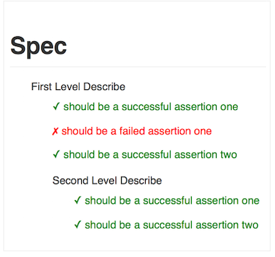

# Karma Spec As HTML Reporter

A Karma reporter that generates an HTML file displaying the test results in a format similar to the Karma Spec Reporter.

## Installation

    npm install karma-spec-as-html-reporter --save-dev

Or, manually add it to your `package.json` file.

     "devDependencies": {
         "karma": "^0.13.1",
         "karma-jasmine": "^0.3.5",
         "karma-spec-as-html-reporter": "^0.0.1"
     }

Then add ``'spec-as-html'`` to reporters in `karma.conf.js`, e.g.

    reporters: ['spec-as-html']

## Configuration

Use the `specAsHtmlReporter` configuration in your `karma.conf.js` file

    specAsHtmlReporter : {
        dir : "dist",              // path to write the file, defaults to `./`
        outputFile: "spec.html"    // name of the file, defaults to `spec.html`
    }

## Example

## To Do

- expose ways to inject CSS to change format of the results
- see if it can be rewritten as an adapter like they do for real
  - take advantage of util.format() ?
  - express markup using the constants (ie: `this.SPEC_FAILURE = '%s %s FAILED' + '\n'` )
- loop through all browsers instead of assuming there is just one

